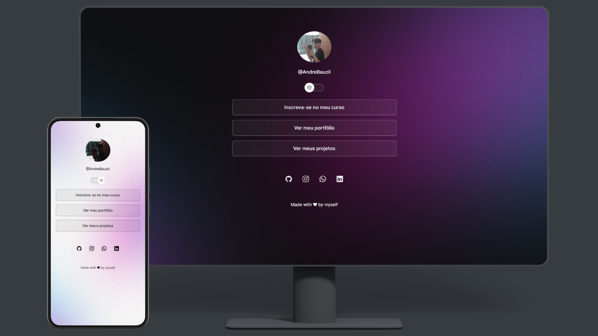

# DevLinks

## Table of Contents <!-- omit in toc -->

- [DevLinks](#devlinks)
  - [🚀 Technologies](#-technologies)
  - [💻 Project](#-project)
  - [🔖 Layout](#-layout)

## 🚀 Technologies

This project was developed with the following technologies:

- HTML and CSS
- JavaScript
- Git and Github
- Figma

## 💻 Project

DevLinks is a link aggregator to use as an online business card.

- [Access the finished project online](https://andrebauzil.github.io/devlinks)

## 🔖 Layout

You can view the project layout through [this link](https://www.figma.com/community/file/1187422022288947321). 
A [Figma](https://figma.com) account is required to access it.

---

Made with ♥ by Bauzil :wave:
